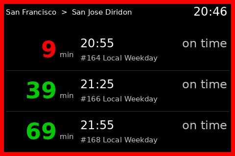
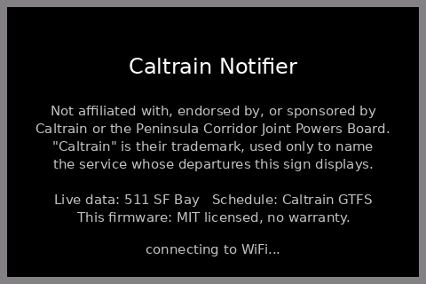
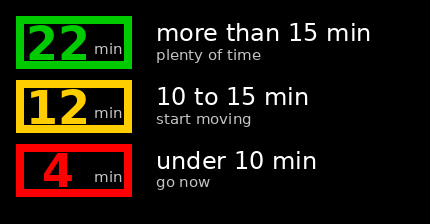

# Caltrain Notifier

[](https://github.com/cheeseprince/caltrain-notifier/actions/workflows/ci.yml)
[](https://cheeseprince.github.io/caltrain-notifier/manifest.txt)
[](https://scorecard.dev/viewer/?uri=github.com/cheeseprince/caltrain-notifier)
[](LICENSE)
[](#ai-assistance)

A desk sign showing the next three Caltrain departures from your station toward
your destination, with a border that turns yellow then red as the train nears.



*Nine minutes to the 20:55 — close enough that the frame has gone red, while the
two behind it are still green. Generated from the committed 511 capture by
`tools/board_dump.cpp`, which links the same board-model, timetable and parser
code the firmware runs, so the trains and countdowns are the ones the device
would show. See [Regenerating the screenshot](#regenerating-the-screenshot).*

Every boot shows who the data belongs to, and who this is not:



The whole point is that you do not have to read it. The border alone tells you
whether to keep sitting down:



| Time to departure | Border | Hex | Meaning |
| :--- | :--- | :--- | :--- |
| more than 15 min | 🟢 Green | `#00CA00` | plenty of time |
| 10 to 15 min | 🟡 Yellow | `#FFCE00` | start moving |
| under 10 min | 🔴 Red | `#FF0000` | go now |

*The hex values are `render.cpp`'s RGB565 constants converted — `0x0640`,
`0xFE60`, `0xF800`. The swatch above is generated from those same constants, so
it cannot drift from what the panel lights up.*

Built for an Elecrow CrowPanel 3.5" (ILI9488 480x320 SPI). Touch is used only to
wake the screen — pressure, never coordinates, so there is nothing to calibrate.
Setup runs from a phone over a captive portal.

---

## Before you build one — four things

**1. You need your own 511 API token. None is provided.**
This project ships no credential of any kind. Get a free token from
<https://511.org/open-data/token>, which means accepting 511's data agreement
yourself. It is entered once through the setup portal and stored in the device's
NVS — never compiled in, never committed. There is no token in this repository
or anywhere in its history.

**2. There is no Caltrain logo, on screen or in this repository.**
The mark belongs to Caltrain, and both data agreements restrict the use of agency
marks. An earlier version could draw a bitmap plate at boot; that code path has
been **removed**, not switched off, so no build of this firmware can display one.
Boot screens are text.

**3. This is not a Caltrain product.**
> Not affiliated with, endorsed by, sponsored by, or approved by Caltrain, the
> Peninsula Corridor Joint Powers Board, the Metropolitan Transportation
> Commission, or 511 SF Bay. "Caltrain" is a trademark of the Peninsula Corridor
> Joint Powers Board, used here only to identify the rail service whose
> departures this device displays.

It is also **not safety equipment**. Predictions come from a third-party feed
that can be wrong, late, or absent. Do not rely on it to catch a train you cannot
afford to miss.

**4. Once flashed, it updates its own firmware over WiFi, once a day, on its own.**
No phone, no button, no prompt — it fetches a signed manifest and installs
whatever it finds, silently, unless you turn that off. It is on by default
because a sign that quietly stops updating is worse than one that updates
itself, but it is a real thing a device on your network does without asking,
and you should know that before you build one. The switch is a checkbox in the
setup portal; see [Over-the-air updates](#over-the-air-updates) for what it
does and does not affect.

Full detail, including what each agency requires: **[ATTRIBUTION.md](ATTRIBUTION.md)**.


## AI assistance

This project was built with substantial help from an AI coding assistant
(Anthropic's Claude) — firmware, the generator tooling, the host tests, and this
documentation. Every change is gated by CI: host tests under `-Werror`, device
builds for both board revisions, and a checksum-pinned secret scan that
self-tests against a generated probe before its result is trusted.

Where the documentation states a fact about the 511 feed, that fact was measured
against the live API with `tools/probe_511.py` and the response committed as a
fixture — not inferred, and not taken from the vendor's description. When a
re-measurement contradicted something already written down, the documentation
changed: see the `RecordedAtTime` note in `src/siri_parse.h`, which records two
disagreeing observations rather than the tidier claim that was there before.
Nothing here is auto-generated and left unchecked.

## Hardware

**Elecrow CrowPanel 3.5" ESP32 HMI display** — ILI9488 480x320 SPI, XPT2046
resistive touch. Roughly $30.

- [Amazon — B0FXLB5CFL](https://www.amazon.com/dp/B0FXLB5CFL)

Also sold directly by Elecrow and through the usual electronics distributors;
any listing for the 3.5" CrowPanel with an ILI9488 should be the same board.
Nothing else is needed — no enclosure, no extra sensors, and the USB-C cable
that flashes it also powers it.

The vendor listing for this board is wrong in two ways that matter. Values below
were read off the unit itself, not the listing — the same `[CHIP]` line
`src/main.cpp` prints on every boot, so any owner of this board can reproduce it.

| | Listing says | Actually is |
| :--- | :--- | :--- |
| Module | ESP32-WROVER-B | **ESP32-D0WD** rev 1.01, 2 cores, 240 MHz |
| Flash | 4 MB | **8 MB** |
| PSRAM | 8 MB | **Unconfirmed** — see below |

PSRAM was never verified. The bring-up build did not enable it, so its report of
zero proves nothing either way. Nothing in this firmware needs it — the display
is drawn directly rather than through LVGL, and the largest API response
measured is about 3 KB — so `BOARD_HAS_PSRAM` is deliberately left undefined
rather than enabled on a guess.

### Board revisions matter — build the one that matches your unit

Elecrow shipped v2.0 and v2.2, which swap two pins:

| | v2.0 | v2.2 |
| :--- | :--- | :--- |
| `TFT_MISO` | 12 | 33 |
| `TOUCH_CS` | 33 | 12 |

Both pins are used. Touch wakes the screen — `display::touched()` reads the
XPT2046's raw pressure, never coordinates, so there is no calibration — and
reading the touch controller needs both `TOUCH_CS` and a real `TFT_MISO`.

So there are **two environments, and you must build the one matching your
board**:

```bash
pio run -e caltrain        # revision 2.2
pio run -e caltrain_v20    # revision 2.0
```

Flashing the wrong one leaves a working display whose screen never wakes on a
tap, with nothing on the console to say why. If tapping does nothing, you are
almost certainly on the other revision — build the other environment.

The unit this was developed on is v2.2. `bringup/` proves the display and touch
independently of the firmware, and is the fastest way to tell the revisions
apart if the silkscreen is ambiguous.

Because `TOUCH_CS` is defined, TFT_eSPI compiles its touch support in and emits
no warning about it. A `TOUCH_CS pin not defined` warning would mean the pin has
gone missing from the build flags and tap-to-wake is silently disabled.

### Pins

| Signal | GPIO |
| :--- | :--- |
| `TFT_MOSI` | 13 |
| `TFT_SCLK` | 14 |
| `TFT_CS` | 15 |
| `TFT_DC` | 2 |
| `TFT_RST` | −1 (tied to the ESP32 reset line) |
| `TFT_MISO` | **33** on v2.2, **12** on v2.0 — read back from the touch controller |
| `TOUCH_CS` | **12** on v2.2, **33** on v2.0 |
| `TFT_BL` | 27 — PWM-capable, which is what makes night dimming possible |
| BOOT button | 0 |

The two revision-dependent pins are the whole reason there are two build
environments; see [Board revisions](#board-revisions-matter--build-the-one-that-matches-your-unit)
above.

---

## Getting it running

### 1. Get a 511 API token

Free, from <https://511.org/open-data/token>. Email verification, then a UUID
arrives.

**Every user gets their own.** No token is distributed with this project, and
requesting one is how you accept 511's data agreement — which is between you and
511, not something this repository can accept on your behalf. The rate limit is
60 requests/hour *per token*, so a shared one would throttle everybody anyway.

The token is entered in the setup portal and stored in NVS. It is never
compiled into the binary — this repo may be shared, and a token in a `.bin` is
recoverable with `strings`.

**Keep it somewhere your phone can read offline.** Step 4 is done while joined to
the sign's own network, which has no internet — see the note there.

For host-side tools only, put a copy where git ignores it:

```bash
echo 'YOUR-TOKEN' > .511-token
```

### 2. Prove the panel

Optional but worth it on a new board:

```bash
./tools/mac_flash.sh bringup
```

The screen should cycle red / green / blue / white / black / cyan / amber, each
labelled and framed to all four edges.

### 3. Flash the firmware

```bash
./tools/mac_flash.sh firmware
```

The script installs PlatformIO into a local `.venv-pio` — nothing touches the
system Python or Homebrew, and deleting the folder is a complete uninstall. It
finds the `cu.*` serial port, builds, uploads, and opens the monitor.

If upload fails to sync: hold **BOOT/IO0**, tap **EN/RST**, release BOOT, retry.

### 4. Set it up from your phone

> **Copy the 511 token to your phone before you start.** The sign's setup
> network has no route to the internet, so once you join it you cannot go and
> fetch the token out of your email — and switching back to look it up drops you
> out of the portal. Have it already in the clipboard, or in a note you can read
> offline.

On first boot the sign raises its own network and shows the details on screen:

1. Join WiFi `Caltrain-XXXX` using the password shown.
   Your phone will warn that the network has no internet. Stay connected — some
   phones silently switch back to cellular or a remembered network otherwise,
   and the portal becomes unreachable halfway through.
2. Open `http://192.168.4.1`.
3. Pick your WiFi network, enter its password, paste the 511 token, and choose
   the two stations.
4. Save. The sign restarts and starts showing departures.

If the page stops loading partway, you have almost certainly come off the sign's
network. Rejoin `Caltrain-XXXX` and open `http://192.168.4.1` again — nothing is
saved until you press Save, so you start that step over, not the whole setup.

**To get back into setup later:** hold **BOOT** while powering on. With no
touchscreen this is the only way in, so it is worth remembering.

---

## How it decides what to show

Two sources, each covering the other's gap:

| | Knows | Does not know |
| :--- | :--- | :--- |
| **511 live feed** | delays, real predictions | only 3 departures ahead; never which stops a train makes |
| **Compiled timetable** | every train, every stop it calls at | anything about today |

So the schedule decides *which* trains belong on the board, and the live feed
corrects *when* they leave.

This matters more than it sounds. 511's `DestinationRef` gives a train's
terminus, not its stop list — so an Express that runs from San Francisco to San
Jose looks identical to a train you could catch, even when it sails straight
past your station. Every live departure is therefore looked up in the timetable
by train number and dropped if that train does not stop at your destination.

### Things measured against the live API, not assumed

All verified with `tools/probe_511.py` — first against an intermediate stop on
weekend service, then re-checked against a terminus on weekday service. The
second capture is committed as `test/fixtures/stopmonitoring_70012.json`:

| Question | Answer |
| :--- | :--- |
| Does `api.511.org` serve HTTPS? | Yes. Certificates are validated against the Mozilla root bundle, not `setInsecure()` |
| Does it gzip? | **Only if you ask.** Without `Accept-Encoding: gzip` it returns plain JSON. The client asks for `identity` explicitly |
| UTF-8 BOM? | No, but the parser tolerates one |
| Response size | ~3.0 KB for three departures |
| Departure cap | **3**, always. `MaximumStopVisits` is accepted and ignored |
| Rate limit | **60 requests/hour per token.** Polling every 75 s uses 48 |
| `RecordedAtTime` | **Inconsistent.** Epoch zero on the intermediate-stop/weekend capture; a real time on the terminus/weekday one (`test/fixtures/stopmonitoring_70012.json`). Not dependable as a freshness signal, so staleness is tracked by the device's own clock |
| Schedule endpoint | `stoptimetable` returns a fixed 4-entry rolling window and ignores `StartTime`/`EndTime`, so it cannot back an offline cache |

That last row is why the timetable is compiled into flash rather than fetched.

### Service patterns

Caltrain runs **three** timetables, not two:

| Pattern | Trips | Runs on |
| :--- | :--- | :--- |
| Weekday | 112 | Mon–Fri |
| Weekend | 66 | Sat/Sun, plus Memorial Day, Labor Day, Thanksgiving, Christmas, New Year's |
| Holiday | 79 | President's Day, Day after Thanksgiving, Christmas Eve, MLK Day |

The third is easy to miss — it appears only in `calendar_dates.txt`, never in
`calendar.txt`, and its trains are numbered `M101` rather than `614`. Treating
those four dates as weekends would show trains that are not running.

### The service day is not the calendar day

Caltrain writes a 00:40 train as `24:40`; it belongs to the previous day's
timetable. At 01:00 on a Saturday the trains still running are Friday's. The
rollover is at 03:00 local — after the last scheduled train (02:30) and before
the first (04:37).

Timezone handling uses the POSIX zone `PST8PDT,M3.2.0,M11.1.0` through libc, so
the same code path runs on the device and in the host tests, including the days
that are 23 or 25 hours long.

---

## Keeping the timetable current

The compiled schedule expires with the GTFS feed (currently valid to
2027-01-31). Caltrain reissues a few times a year. Regenerate **both** headers
from the same feed, since they share a station index space:

```bash
python3 tools/gen_stations.py
python3 tools/gen_timetable.py
cd test && make          # the tests assert against real service
```

Then reflash. Both generators print what they skipped and why — a silently
dropped train is how a timetable quietly goes wrong.

This is enforced, not just documented: CI's `timetable-freshness` job fails 90
days before the compiled schedule's earlier validity bound (the last holiday
override, or the GTFS feed's own end date, whichever comes first), and the
board itself shows "TIMETABLE EXPIRED - holidays may differ" once that bound
has actually passed, rather than silently running a full weekday timetable of
trains that are not running.

---

## Over-the-air updates

Once flashed, the sign checks for a new release **once a day** on its own —
no phone, no button, nothing to plug in. It fetches a small manifest over
WiFi, and only installs what it finds if that manifest carries a valid
cryptographic signature.

**Unsigned releases are refused, full stop.** There is no fallback mode: an
absent, malformed, or invalid signature ends the check with nothing
installed (`src/ota_verify.h`, `src/ota_task.cpp`). The publishing tools in
this repository (`.github/workflows/release.yml`,
`tools/publish_ota.sh`) enforce the same rule on the way out — both refuse to
publish a release with no signing key, rather than shipping a channel every
device would silently ignore.

### Turning it off

The daily check is a checkbox — "Install firmware updates automatically" — on
the setup portal's main page, alongside the brightness schedule. **It defaults
to on**, for the reason given [above](#before-you-build-one--four-things): a
sign that has quietly stopped updating looks identical to one that is up to
date, until it isn't.

Unchecking it only stops the *next* check from starting; it does not touch
one already running, and it does nothing to a build that just installed and
is waiting to prove itself. That distinction matters: a freshly installed
image boots on trial and has to call a rollback-cancelling API within a few
minutes of showing real departures, or the bootloader reverts it on the next
reset. Turning auto-update off the moment after an install completes does not
interfere with that trial one way or the other — the build still gets to earn
its keep, or get rolled back on its own merits, exactly as if the setting had
stayed on.

### Cutting a release

```bash
git tag v1.2.0 && git push --tags
```

That triggers `release.yml`, which builds **both** board revisions
(`caltrain` and `caltrain_v20` — a release missing either one leaves that
revision unable to ever update), signs the manifest with the
`OTA_SIGNING_KEY` repository secret, verifies that signature against the
public key actually compiled into the firmware, and publishes the result to
the `gh-pages` branch. `tools/publish_ota.sh` does the same thing from a
workstation, for when CI is not the right path — it looks for the private
key at `~/caltrain-ota-signing-key.pem` (override with
`OTA_SIGNING_KEY_FILE`) and refuses to run without it, for the same reason.

### What you see on the desk

The sign owns the screen for the whole attempt: a title, a progress bar, a
version line reading `vFrom  >  vTo`, the current step (fetching the
manifest, verifying its signature, downloading, installing), and a
**"do not unplug"** warning. If anything fails along the way — no signature,
a bad hash, a dropped connection — the device gives up cleanly, keeps
running the firmware it already had, and quietly tries again on its next
daily check.

### The one step that has to happen first, on USB

**A device trusts only the public key that was compiled into the build it is
currently running** (`src/ota_pubkey.h`). That means the very first
OTA-capable firmware cannot arrive over the air — there is nothing on the
device yet to verify it against. It has to go on over USB
(`./tools/mac_flash.sh firmware`) at least once. Every release after that can
arrive wirelessly, because by then the device already holds the key needed
to check it.

It also means rotating the signing key stops OTA for every unit already in
the field until each one is re-flashed over USB with the new public key —
see `SECURITY.md` for the full trust model.

---

## Development

Bug reports, vulnerability reports and pull requests: see
[CONTRIBUTING.md](CONTRIBUTING.md).

### Host tests

Pure logic — station lookup, direction, schedule queries, JSON parsing, the
board merge, DST — builds and runs on any desktop with no board and no network:

```bash
cd test && make
```

Hardware, WiFi and NVS live behind `#ifdef ARDUINO` seams so the logic stays
testable. Tests are deliberately mutation-checked: several were found to pass
against a deliberately broken implementation and were retargeted until they
failed.

### Layout

```
src/
  stations.h        GENERATED — 30 stations, ordered north to south
  timetable_data.h  GENERATED — 257 trips, 5,414 calls, ~24 KB
  route.*           station lookup, direction, platform stop_id      [pure]
  timetable.*       service patterns, schedule queries               [pure]
  siri_parse.*      511 JSON -> departures                           [pure]
  board_model.*     merge live over schedule, express filter, colour [pure]
  service_day.*     Pacific time, DST, the 03:00 service rollover    [pure]
  config.*          NVS settings; validation half is pure
  siri_client.*     HTTPS GET                                        [device]
  display_hw.*      panel init, backlight PWM                        [device]
  render.*          the screens                                      [device]
  portal.*          SoftAP captive portal                            [device]
  main.cpp          poll loop and 1 Hz tick
tools/
  gen_stations.py   GTFS -> src/stations.h
  gen_timetable.py  GTFS -> src/timetable_data.h
  board_dump.cpp    board model -> JSON, for the screenshot (host build)
  gen_screenshot.py that JSON -> docs/images/*.png
  probe_511.py      measures the live API; run before trusting assumptions
  package.sh        tarball for transfer to the build machine
  mac_flash.sh      build and flash from macOS
bringup/            standalone panel smoke test
third_party/        ArduinoJson 7.1.0, vendored
```

ArduinoJson is vendored rather than listed in `lib_deps` because plain `g++`
cannot reach into `.pio/libdeps`. Vendoring is what makes the host tests
exercise the same parser the device runs rather than a lookalike.

### Footprint

| | Used | Available |
| :--- | :--- | :--- |
| Flash | 1.12 MB | 3.34 MB app slot |
| RAM | 57.6 KB | 320 KB |

Two app slots plus 1.5 MB filesystem, so a signed-OTA path stays open.

---

## Inherited gotchas

Carried over from bringing this same board up for `obd-gauge-cluster`. Each cost
real debugging time once already.

- **Do not define `TFT_WIDTH`/`TFT_HEIGHT`.** `ILI9488_Defines.h` sets them to
  portrait 320×480; the app uses its own `W=480 H=320` with `setRotation(1)`.
- **Pin the platform.** A bare `espressif32` resolves to whatever is installed,
  and a global pioarduino install silently swaps the Arduino core 2.x → 3.x.
  That difference is invisible until something fails to compile — as
  `setCACertBundle()` did here, which takes one argument on core 2.x and two on
  core 3.x.
- **Pin `lib_deps` exactly, no carets.** Dependabot has no PlatformIO ecosystem,
  so nothing proposes bumps; a caret range means the same commit can build a
  different binary later.
- **Keep the HTTP read buffer file-scope `static`.** A 4 KB local plus a TLS
  handshake overflows the ~8 KB `loopTask` stack — that produced a panic-reboot
  with a blank screen once already.
- **`setCACertBundle()` is not automatic on core 2.x.** The pointer must be
  passed explicitly or validation silently does nothing.
- **Use signed `millis()` deltas** — `(int32_t)(now - then)` — or the timers
  stall at the 49-day rollover.
- **Negative `HTTPClient` codes are not HTTP statuses.** `-1` means the
  connection never opened.
- **macOS: prefer the `cu.*` port.** Opening `tty.*` blocks on carrier detect.

### Traps found building this one

Distinct from the list above, which was carried over. Each of these shipped or
nearly shipped.

- **`configTime(0, 0, ...)` silently sets the timezone**, clobbering Pacific and
  making the whole screen read UTC. Use `configTzTime(SERVICE_DAY_TZ, ...)`.
  This shipped once.
- **You cannot erase text by drawing it in the background colour.** TFT_eSPI's
  padding fill is guarded by
  `if ((padX > cwidth) && (textcolor != textbgcolor))`, so a
  background-on-background draw of an empty string does nothing at all, and the
  old pixels survive until the next full repaint. This shipped once, as a
  staleness note frozen at "live data 240s old" through hours of healthy
  fetches. Clear with `fillRect`. Every other field on the board happens to
  erase correctly only because its colour differs from the background.
- **Mid-grey on black fails off-axis.** `COL_DIM` was `0x8410`, a true 50% grey,
  and became unreadable a few tens of degrees off centre — which is how a desk
  sign is actually seen. It is now `0xC618`.
- **`doFetch()` blocks the tick loop** for the length of the HTTPS round trip,
  up to ~19 s measured. The clock and countdowns freeze for that window on every
  poll. The fetch now runs pinned to core 0, which is what makes that tolerable.
- **`intelhex` is easy to have globally and not in a fresh venv.** Its absence
  makes `esptool` fail at flash time, not at build time, so a green build on the
  development machine proved nothing about the machine with the board attached.

## Regenerating the screenshot

The board image at the top is generated, not mocked up:

```bash
g++ -std=c++17 -Isrc -Ithird_party tools/board_dump.cpp \
    src/board_model.cpp src/timetable.cpp src/route.cpp src/siri_parse.cpp \
    -o /tmp/board_dump
TZ=America/Los_Angeles /tmp/board_dump "San Francisco" "San Jose Diridon" \
    test/fixtures/stopmonitoring_70012.json | python3 tools/gen_screenshot.py

python3 tools/gen_screenshot.py --splash          # the boot screen
python3 tools/gen_screenshot.py --legend          # the urgency swatch
```

The splash renderer reads the attribution strings out of `src/render.cpp` rather
than restating them, and warns if a line overruns the panel. Two copies of a
legal notice drift apart, and the copy in the picture is the one people quote.

`board_dump.cpp` is a printf around `buildBoard()` — it links the same modules
the firmware does rather than reimplementing them, so the numbers are real. The
geometry and the RGB565 colours in `gen_screenshot.py` are copied from
`render.cpp`; the typeface is not, because TFT_eSPI's bitmap fonts are not
distributable as a TTF, so DejaVu Sans stands in at the same pixel heights. An
accurate diagram of a real board, then, rather than a photograph of one — and if
`render.cpp`'s layout changes, `gen_screenshot.py` has to be changed with it.

Values in the generated header are readable RGB565 literals, so every push must
be wrapped in `setSwapBytes(true)` with the previous value restored. Wrong
colours with a correct-looking image means that flag.

## Conventions

- Pure logic lives in host-tested modules; Arduino, WiFi and NVS sit behind
  `#ifdef ARDUINO`. That split is what lets `cd test && make` run the interesting
  half with no board and no network.
- **Tests are mutation-checked.** Several passed against deliberately broken code
  before being retargeted — if a test cannot be made to fail, it is not testing
  anything.
- `platformio.ini` pins the platform and every library exactly. A bare
  `espressif32` resolves to whatever is installed and silently swaps the Arduino
  core.
- Credentials live in NVS only, never in source and never in a binary.

## Licence, attribution and credits

This project's own code is **MIT** — see [LICENSE](LICENSE).

**The transit data is not this project's to license.** It is produced, owned and
published by others, under terms that require them to be acknowledged. Two of
those acknowledgments are contractual rather than courtesies, so they are set out
in full in **[ATTRIBUTION.md](ATTRIBUTION.md)** rather than compressed into a
credits line. In brief:

| What | Whose | Terms |
| :--- | :--- | :--- |
| Live departure predictions | **511 SF Bay** (MTC), via `api.511.org` | Acknowledgment of 511.org as data provider is **required**. Each user brings their own token and accepts the agreement themselves. |
| Timetable and station data | **Caltrain / PCJPB**, feed published by [Trillium](https://trilliumtransit.com/) | PCJPB retains ownership and grants limited, revocable rights to redistribute. `src/stations.h` and `src/timetable_data.h` are derivative works of that feed. |
| The "Caltrain" name | **PCJPB** trademark | Used nominatively to identify the service. Not affiliated or endorsed. **Logo deliberately excluded.** |

Third-party code — ArduinoJson (MIT, vendored) and TFT_eSPI by Bodmer
(FreeBSD/BSD-2, pinned dependency) — is listed with versions and licence texts in
**[THIRD-PARTY-NOTICES.md](THIRD-PARTY-NOTICES.md)**.

Security policy and known limitations: **[SECURITY.md](SECURITY.md)**.

CI runs on every push and pull request: a checksum-pinned secret scan (which
self-tests against a generated probe before it is trusted), the host suite, and
a device build for both board revisions. See
[`.github/workflows/ci.yml`](.github/workflows/ci.yml).
