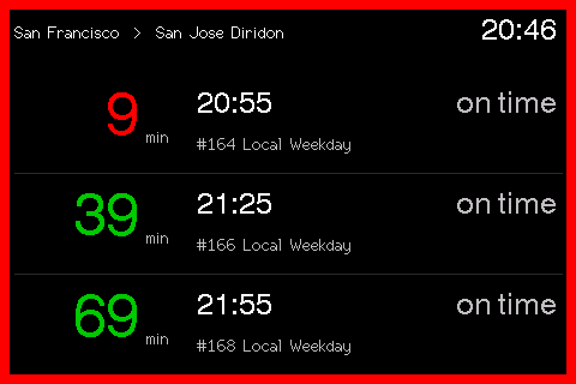
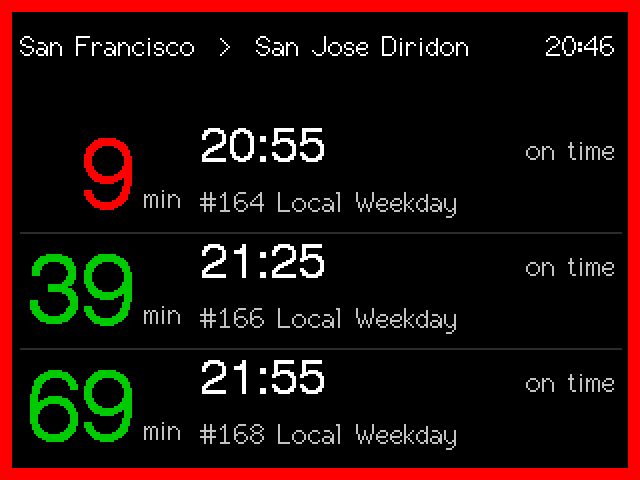
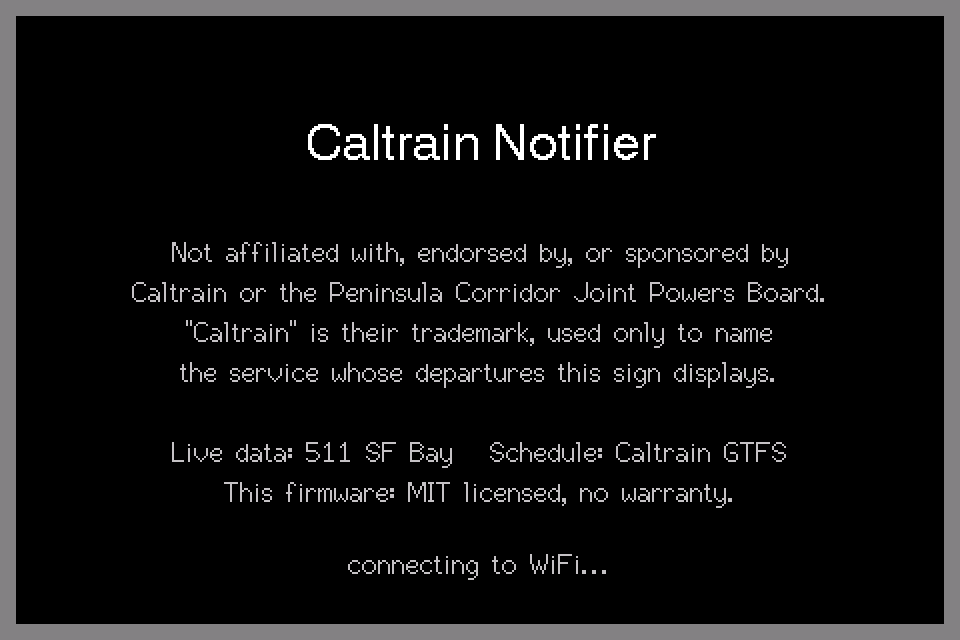
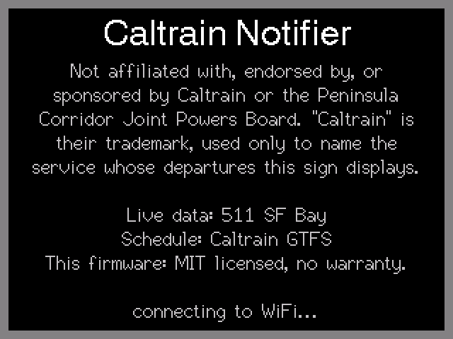
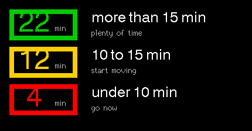

<div align="center">

<h1>Caltrain Notifier</h1>

[](https://github.com/cheeseprince/caltrain-notifier/actions/workflows/ci.yml)
[](https://cheeseprince.github.io/caltrain-notifier/manifest.txt)
[](https://scorecard.dev/viewer/?uri=github.com/cheeseprince/caltrain-notifier)
[](LICENSE)
[](#ai-assistance)

<p>
A desk sign showing the next three Caltrain departures from your station toward
your destination, with a border that turns yellow then red as the train nears.
</p>

<p>
<a href="#getting-it-running"><strong>Build one</strong></a>
&middot;
<a href="#4-set-it-up-from-your-phone">Setup</a>
&middot;
<a href="docs/HARDWARE.md">Hardware notes</a>
&middot;
<a href="docs/DEVELOPMENT.md">Developer docs</a>
&middot;
<a href="https://github.com/cheeseprince/caltrain-notifier/issues">Report a bug</a>
&middot;
<a href="SECURITY.md">Security</a>
</p>

<!-- Board and splash images are shown at true relative size: the 3.5" panel is
     165 px/in and the 2.8" is 143 px/in, so the 2.8" images display 1.154x
     their pixel width (320 -> 369, 240 -> 277) against the 3.5"'s 480 x 320.
     The @2x files keep both sharp on high-DPI screens. -->



<sub>The 3.5" CrowPanel (left) and the 2.8" ES3C28P, at true relative size.</sub>

</div>

<details>
<summary><strong>Table of contents</strong></summary>

- [What it shows](#what-it-shows)
- [Before you build one — four things](#before-you-build-one--four-things)
- [Hardware](#hardware)
- [Getting it running](#getting-it-running)
  - [Prerequisites](#prerequisites)
  - [1. Get a 511 API token](#1-get-a-511-api-token)
  - [2. Prove the panel](#2-prove-the-panel)
  - [3. Flash the firmware](#3-flash-the-firmware)
  - [4. Set it up from your phone](#4-set-it-up-from-your-phone)
- [How it decides what to show](#how-it-decides-what-to-show)
- [Over-the-air updates](#over-the-air-updates)
- [AI assistance](#ai-assistance)
- [Licence, attribution and credits](#licence-attribution-and-credits)

Elsewhere: [Hardware notes](docs/HARDWARE.md) ·
[Developer docs](docs/DEVELOPMENT.md) · [Contributing](CONTRIBUTING.md) ·
[Attribution](ATTRIBUTION.md) · [Security](SECURITY.md)

</details>

## What it shows

*Above: nine minutes to the 20:55 — close enough that the frame has gone red,
while the two behind it are still green. Both images are generated from the committed 511
capture by `tools/board_dump.cpp`, which links the same board-model, timetable
and parser code the firmware runs, and drawn with the panel's own fonts — so the
trains, countdowns and pixels are the ones the device would show. See
[Regenerating the screenshots](docs/DEVELOPMENT.md#regenerating-the-screenshots).*

Every boot shows who the data belongs to, and who this is not:




The whole point is that you do not have to read it. The border alone tells you
whether to keep sitting down:



| Time to departure | Border | Hex | Meaning |
| :--- | :--- | :--- | :--- |
| more than 15 min | 🟢 Green | `#00CA00` | plenty of time |
| 10 to 15 min | 🟡 Yellow | `#FFCE00` | start moving |
| under 10 min | 🔴 Red | `#FF0000` | go now |

Those are the **defaults**, not the rule. Both boundaries are set in the setup
portal — "red when under N minutes" and "yellow when under M minutes", each 1 to
60 — so a longer walk to the platform gets a longer warning. Setting the two to
the same number drops the yellow band and leaves a red-and-green sign. The rule
itself lives in [`src/urgency.h`](src/urgency.h); a device updating from an
earlier build keeps 10 and 16, which is exactly the behaviour above.

*The hex values are `render.cpp`'s RGB565 constants converted — `0x0640`,
`0xFE60`, `0xF800`. The swatch above is generated from those same constants, so
it cannot drift from what the panel lights up.*

Runs on two boards — the Elecrow CrowPanel 3.5" and the QDtech ES3C28P 2.8";
see [Hardware](#hardware). Touch is used only to wake the screen — never
coordinates, so there is nothing to calibrate. Setup runs from a phone over a
captive portal.

---

## Before you build one — four things

**1. You need your own 511 API token. None is provided.**
This project ships no credential of any kind. Get a free token from
<https://511.org/open-data/token>, which means accepting 511's data agreement
yourself. It is entered once through the setup portal and stored in the device's
NVS — never compiled in, never committed. There is no token in this repository
or anywhere in its history.

**2. There is no Caltrain logo, on screen or in this repository.**
The mark belongs to Caltrain, and both data agreements restrict the use of agency
marks. An earlier version could draw a bitmap plate at boot; that code path has
been **removed**, not switched off, so no build of this firmware can display one.
Boot screens are text.

**3. This is not a Caltrain product.**
> Not affiliated with, endorsed by, sponsored by, or approved by Caltrain, the
> Peninsula Corridor Joint Powers Board, the Metropolitan Transportation
> Commission, or 511 SF Bay. "Caltrain" is a trademark of the Peninsula Corridor
> Joint Powers Board, used here only to identify the rail service whose
> departures this device displays.

It is also **not safety equipment**. Predictions come from a third-party feed
that can be wrong, late, or absent. Do not rely on it to catch a train you cannot
afford to miss.

**4. Once flashed, it updates its own firmware over WiFi, once a day, on its own.**
No phone, no button, no prompt — it fetches a signed manifest and installs
whatever it finds, silently, unless you turn that off. It is on by default
because a sign that quietly stops updating is worse than one that updates
itself, but it is a real thing a device on your network does without asking,
and you should know that before you build one. The switch is a checkbox in the
setup portal; see [Over-the-air updates](#over-the-air-updates) for what it
does and does not affect.

Full detail, including what each agency requires: **[ATTRIBUTION.md](ATTRIBUTION.md)**.

## Hardware

| | Elecrow CrowPanel 3.5" | QDtech ES3C28P 2.8" |
| :--- | :--- | :--- |
| Chip | ESP32-D0WD | ESP32-S3 |
| Panel | ILI9488, 480x320, SPI | ILI9341V IPS, 320x240, SPI |
| Touch (wake only) | XPT2046 resistive | FT6336G capacitive, I2C |
| Flash / PSRAM | 8 MB / unconfirmed | 16 MB / 8 MB (unused) |
| Build environment | `caltrain` (v2.2) or `caltrain_v20` (v2.0) | `caltrain_es3c28p` |
| Amazon | [B0FXLB5CFL](https://www.amazon.com/dp/B0FXLB5CFL) | [B0FKG7WRWV](https://www.amazon.com/dp/B0FKG7WRWV) |

Nothing else is needed for either — no enclosure, no extra sensors, and the
USB-C cable that flashes the board also powers it.

**CrowPanel owners: build the environment that matches your board revision.**
v2.0 and v2.2 swap two pins; the wrong build gives a working display whose
screen never wakes on a tap. Revisions, pin tables, what the vendor listings
get wrong and bring-up notes for both boards: **[docs/HARDWARE.md](docs/HARDWARE.md)**.

---

## Getting it running

### Prerequisites

- [ ] One of the two [supported boards](#hardware) and a USB-C data cable
- [ ] Your own free 511 API token — step 1 below
- [ ] A Mac or Linux machine with Python 3; `tools/mac_flash.sh` installs
      PlatformIO into a local `.venv-pio` for you (on Linux, `pip install
      -r requirements.txt` and use `pio` directly)
- [ ] A 2.4 GHz WiFi network the sign can join, and a phone to run setup

### 1. Get a 511 API token

Free, from <https://511.org/open-data/token>. Email verification, then a UUID
arrives.

**Every user gets their own.** No token is distributed with this project, and
requesting one is how you accept 511's data agreement — which is between you and
511, not something this repository can accept on your behalf. The rate limit is
60 requests/hour *per token*, so a shared one would throttle everybody anyway.

The token is entered in the setup portal and stored in NVS. It is never
compiled into the binary — this repo may be shared, and a token in a `.bin` is
recoverable with `strings`.

**Keep it somewhere your phone can read offline.** Step 4 is done while joined to
the sign's own network, which has no internet — see the note there.

For host-side tools only, put a copy where git ignores it:

```bash
echo 'YOUR-TOKEN' > .511-token
```

### 2. Prove the panel

Optional but worth it on a new CrowPanel (`bringup/` is a CrowPanel smoke
test; the ES3C28P goes straight to step 3):

```bash
./tools/mac_flash.sh bringup
```

The screen should cycle red / green / blue / white / black / cyan / amber, each
labelled and framed to all four edges.

### 3. Flash the firmware

```bash
./tools/mac_flash.sh firmware          # CrowPanel v2.2
./tools/mac_flash.sh firmware v20      # CrowPanel v2.0
```

The script installs PlatformIO into a local `.venv-pio` — nothing touches the
system Python or Homebrew, and deleting the folder is a complete uninstall. It
finds the `cu.*` serial port, builds, uploads, and opens the monitor.

If upload fails to sync: hold **BOOT/IO0**, tap **EN/RST**, release BOOT, retry.

For the ES3C28P, `./tools/mac_flash.sh firmware es3c28p`. Its ESP32-S3 has
native USB, so on macOS it appears as `cu.usbmodem*` and on Linux as
`/dev/ttyACM0`, with no driver:

```bash
pio run -e caltrain_es3c28p -t upload --upload-port /dev/ttyACM0
```

### 4. Set it up from your phone

> **Copy the 511 token to your phone before you start.** The sign's setup
> network has no route to the internet, so once you join it you cannot go and
> fetch the token out of your email — and switching back to look it up drops you
> out of the portal. Have it already in the clipboard, or in a note you can read
> offline.

On first boot the sign raises its own network and shows the details on screen:

1. Join WiFi `Caltrain-XXXX` using the password shown.
   Your phone will warn that the network has no internet. Stay connected — some
   phones silently switch back to cellular or a remembered network otherwise,
   and the portal becomes unreachable halfway through.
2. Open `http://192.168.4.1`.
3. Pick your WiFi network, enter its password, paste the 511 token, and choose
   the two stations.
4. Optionally adjust the brightness window and the **border timers** — how many
   minutes out the frame turns red and yellow. The defaults, 10 and 16, give the
   bands in the table above; the form spells out what your numbers will do
   before you save.
5. Save. The sign restarts and starts showing departures.

If the page stops loading partway, you have almost certainly come off the sign's
network. Rejoin `Caltrain-XXXX` and open `http://192.168.4.1` again — nothing is
saved until you press Save, so you start that step over, not the whole setup.

**To get back into setup later:** hold **BOOT** while powering on. Touch only
wakes the screen, so this is the only way in, and it is worth remembering.

---

## How it decides what to show

Two sources, each covering the other's gap:

| | Knows | Does not know |
| :--- | :--- | :--- |
| **511 live feed** | delays, real predictions | only 3 departures ahead; never which stops a train makes |
| **Compiled timetable** | every train, every stop it calls at | anything about today |

So the schedule decides *which* trains belong on the board, and the live feed
corrects *when* they leave.

This matters more than it sounds. 511's `DestinationRef` gives a train's
terminus, not its stop list — so an Express that runs from San Francisco to San
Jose looks identical to a train you could catch, even when it sails straight
past your station. Every live departure is therefore looked up in the timetable
by train number and dropped if that train does not stop at your destination.

What the live API was measured to actually do, Caltrain's three timetables,
and why the service day rolls over at 03:00:
[docs/DEVELOPMENT.md](docs/DEVELOPMENT.md#how-it-decides-what-to-show--the-details).

---

## Over-the-air updates

Once flashed, the sign checks for a new release **once a day** on its own —
no phone, no button, nothing to plug in. It fetches a small manifest over
WiFi, and only installs what it finds if that manifest carries a valid
cryptographic signature.

**Unsigned releases are refused, full stop.** There is no fallback mode: an
absent, malformed, or invalid signature ends the check with nothing
installed (`src/ota_verify.h`, `src/ota_task.cpp`). The publishing tools in
this repository (`.github/workflows/release.yml`,
`tools/publish_ota.sh`) enforce the same rule on the way out — both refuse to
publish a release with no signing key, rather than shipping a channel every
device would silently ignore.

### Turning it off

The daily check is a checkbox — "Install firmware updates automatically" — on
the setup portal's main page, alongside the brightness schedule. **It defaults
to on**, for the reason given [above](#before-you-build-one--four-things): a
sign that has quietly stopped updating looks identical to one that is up to
date, until it isn't.

Unchecking it only stops the *next* check from starting; it does not touch
one already running, and it does nothing to a build that just installed and
is waiting to prove itself. That distinction matters: a freshly installed
image boots on trial and has to call a rollback-cancelling API within a few
minutes of showing real departures, or the bootloader reverts it on the next
reset. Turning auto-update off the moment after an install completes does not
interfere with that trial one way or the other — the build still gets to earn
its keep, or get rolled back on its own merits, exactly as if the setting had
stayed on.

### What you see on the desk

The sign owns the screen for the whole attempt: a title, a progress bar, a
version line reading `vFrom  >  vTo`, the current step (fetching the
manifest, verifying its signature, downloading, installing), and a
**"do not unplug"** warning. If anything fails along the way — no signature,
a bad hash, a dropped connection — the device gives up cleanly, keeps
running the firmware it already had, and quietly tries again on its next
daily check.

### The one step that has to happen first, on USB

**A device trusts only the public key that was compiled into the build it is
currently running** (`src/ota_pubkey.h`). That means the very first
OTA-capable firmware cannot arrive over the air — there is nothing on the
device yet to verify it against. It has to go on over USB
(`./tools/mac_flash.sh firmware`) at least once. Every release after that can
arrive wirelessly, because by then the device already holds the key needed
to check it.

It also means rotating the signing key stops OTA for every unit already in
the field until each one is re-flashed over USB with the new public key —
see `SECURITY.md` for the full trust model.

---

Cutting and signing a release: [docs/DEVELOPMENT.md](docs/DEVELOPMENT.md#cutting-a-release).

---

## AI assistance

This project was built with substantial help from an AI coding assistant
(Anthropic's Claude) — firmware, the generator tooling, the host tests, and this
documentation. Every change is gated by CI: host tests under `-Werror`, device
builds for every supported board, and a checksum-pinned secret scan that
self-tests against a generated probe before its result is trusted.

Where the documentation states a fact about the 511 feed, that fact was measured
against the live API with `tools/probe_511.py` and the response committed as a
fixture — not inferred, and not taken from the vendor's description. When a
re-measurement contradicted something already written down, the documentation
changed: see the `RecordedAtTime` note in `src/siri_parse.h`, which records two
disagreeing observations rather than the tidier claim that was there before.
Nothing here is auto-generated and left unchecked.

## Licence, attribution and credits

This project's own code is **MIT** — see [LICENSE](LICENSE).

**The transit data is not this project's to license.** It is produced, owned and
published by others, under terms that require them to be acknowledged. Two of
those acknowledgments are contractual rather than courtesies, so they are set out
in full in **[ATTRIBUTION.md](ATTRIBUTION.md)** rather than compressed into a
credits line. In brief:

| What | Whose | Terms |
| :--- | :--- | :--- |
| Live departure predictions | **511 SF Bay** (MTC), via `api.511.org` | Acknowledgment of 511.org as data provider is **required**. Each user brings their own token and accepts the agreement themselves. |
| Timetable and station data | **Caltrain / PCJPB**, feed published by [Trillium](https://trilliumtransit.com/) | PCJPB retains ownership and grants limited, revocable rights to redistribute. `src/stations.h` and `src/timetable_data.h` are derivative works of that feed. |
| The "Caltrain" name | **PCJPB** trademark | Used nominatively to identify the service. Not affiliated or endorsed. **Logo deliberately excluded.** |

Third-party code — ArduinoJson (MIT, vendored) and TFT_eSPI by Bodmer
(FreeBSD/BSD-2, pinned dependency) — is listed with versions and licence texts in
**[THIRD-PARTY-NOTICES.md](THIRD-PARTY-NOTICES.md)**.

Security policy and known limitations: **[SECURITY.md](SECURITY.md)**.

CI runs on every push and pull request: a checksum-pinned secret scan (which
self-tests against a generated probe before it is trusted), the host suite, and
a device build for every supported board. See
[`.github/workflows/ci.yml`](.github/workflows/ci.yml).
